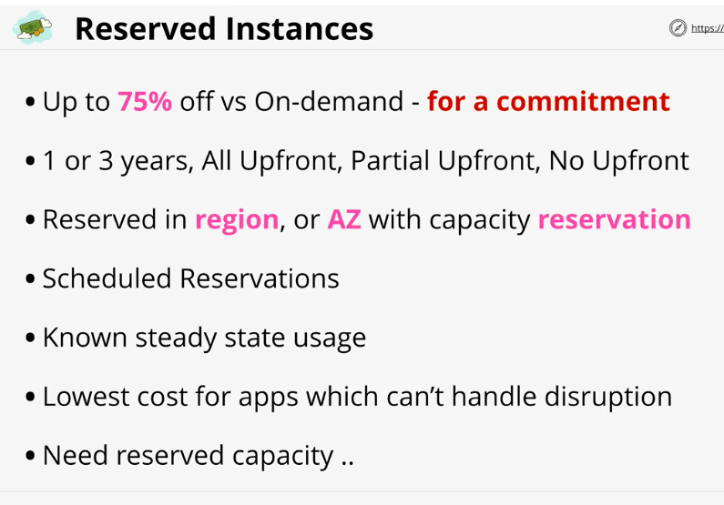
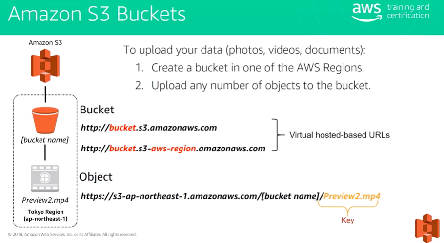
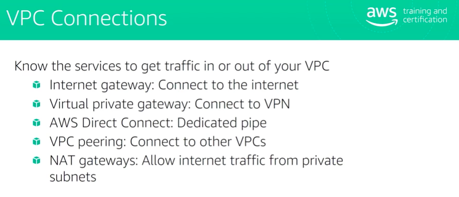

{width="6.263888888888889in" height="2.95625in"}

{width="6.263888888888889in"
height="3.347916666666667in"}

{width="6.263888888888889in"
height="3.359027777777778in"}

{width="6.263888888888889in"
height="3.459722222222222in"}

{width="6.263888888888889in"
height="3.563888888888889in"}

{width="6.263888888888889in"
height="3.3715277777777777in"}

[[https://ec2instances.info/]{.underline}](https://ec2instances.info/)

{width="6.263888888888889in"
height="2.8652777777777776in"}

{width="6.263888888888889in"
height="4.384722222222222in"}

EBS -- Block storage

EFS -- File storage

S3 - Object storage

{width="6.263888888888889in"
height="3.790277777777778in"}

{width="6.263888888888889in"
height="3.2263888888888888in"}

{width="6.263888888888889in"
height="3.329861111111111in"}

{width="6.263888888888889in"
height="2.4972222222222222in"}

{width="5.911193132108487in"
height="4.302326115485564in"}

{width="4.493232720909886in"
height="2.5116272965879265in"}

{width="4.493055555555555in"
height="2.3182578740157482in"}

Exam power up

{width="6.263888888888889in"
height="3.6083333333333334in"}

Data stored on instant store can be lost when EC2 instance stops and
starts (not on restarts).

{width="6.263888888888889in"
height="0.7326388888888888in"}

{width="6.263888888888889in"
height="2.6180555555555554in"}

{width="6.263888888888889in"
height="3.8368055555555554in"}

EBS Snapshots are backups of data consumed within EBS Volumes - Stored
on S3.

Snapshots are incremental, the first being a full back up - and any
future snapshots being incremental.

Snapshots can be used to migrate data to different availability zones in
a region, or to different regions of AWS.

{width="5.9534722222222225in"
height="3.1325021872265966in"}

{width="5.953488626421697in"
height="3.182014435695538in"}

{width="6.263888888888889in"
height="3.7090277777777776in"}

{width="6.294436789151356in"
height="3.1046511373578305in"}

{width="6.263888888888889in" height="3.175in"}

{width="6.263888888888889in"
height="2.7645833333333334in"}

{width="6.263888888888889in"
height="3.3604166666666666in"}

{width="6.263888888888889in"
height="3.357638888888889in"}

{width="6.263888888888889in"
height="3.0340277777777778in"}

{width="6.263888888888889in"
height="3.3555555555555556in"}

{width="6.263888888888889in"
height="3.5034722222222223in"}

EC2 Offers a few instance payment models .. on-demand, spot and
reserved. As a solutions architect it\'s essential that you understand
when to use each.

{width="4.197673884514436in"
height="3.5280008748906386in"}

{width="6.263888888888889in"
height="3.595833333333333in"}

{width="6.263888888888889in"
height="3.7881944444444446in"}

{width="6.263888888888889in"
height="4.372916666666667in"}

Instance status checks perform a number of health checks on the EC2
system and instances to determine instance health.

Q: What are the different payment options for RIs?

You can choose from three payment options when you purchase an RI. With
the All **Upfront** option, you pay for the entire RI term with one
upfront payment. With the **Partial Upfront** option, you make a low
upfront payment and are then charged a discounted hourly rate for the
instance for the duration of the RI term. The **No Upfront** option does
not require any upfront payment and provides a discounted hourly rate
for the duration of the term.

Q: When are RIs activated?

The billing discount and capacity reservation (if applicable) is
activated once your payment has successfully been authorized. You can
view the status (pending \| active \| retired) of your RIs on the
\"Reserved Instances\" page of the Amazon EC2 Console.

Q: Do RIs apply to Spot instances or instances running on a Dedicated
Host?

No, RIs do not apply to Spot instances or instances running on Dedicated
Hosts. To lower the cost of using Dedicated Hosts, purchase Dedicated
Host Reservations.

Differences between regional and zonal Reserved Instances
---------------------------------------------------------

The following table highlights some key differences between regional
Reserved Instances and zonal Reserved Instances:

                                  **Regional Reserved Instances**                                                                                                                                                         **Zonal Reserved Instances**
  ------------------------------- --------------------------------------------------------------------------------------------------------------------------------------------------------------------------------------- ----------------------------------------------------------------------------------------------------------------------------------------
  Availability Zone flexibility   The Reserved Instance discount applies to instance usage in any Availability Zone in the specified Region.                                                                              No Availability Zone flexibility---the Reserved Instance discount applies to instance usage in the specified Availability Zone only.
  Capacity reservation            No capacity reservation---a regional Reserved Instance does *not* provide a capacity reservation.                                                                                       A zonal Reserved Instance provides a capacity reservation in the specified Availability Zone.
  Instance size flexibility       The Reserved Instance discount applies to instance usage within the instance family, regardless of size. Only supported on Amazon Linux/Unix Reserved Instances with default tenancy.   No instance size flexibility---the Reserved Instance discount applies to instance usage for the specified instance type and size only.

### **On-Demand Capacity Reservation**

On-Demand Capacity Reservation is an EC2 offering that lets you create
and manage reserved capacity on Amazon EC2. You can create a Capacity
Reservation by choosing an Availability Zone and quantity (number of
instances) along with other instance specifications such as instance
type and tenancy. Once created, the EC2 capacity is held for you
regardless of whether you run the instances or not.

Within AWS Horizontal and Vertical scaling are two ways which systems
have to deal with increasing or decreasing user-side load.

Each has pros and cons but handles the act of scaling radically
differently.

{width="6.263888888888889in"
height="3.5256944444444445in"}

{width="6.263888888888889in"
height="3.1729166666666666in"}

{width="6.263888888888889in"
height="3.1319444444444446in"}

{width="6.263888888888889in"
height="3.7270833333333333in"}

{width="6.263888888888889in"
height="3.404861111111111in"}

{width="6.263888888888889in"
height="3.4118055555555555in"}

{width="6.263888888888889in"
height="3.2930555555555556in"}

{width="6.263888888888889in"
height="3.303472222222222in"}

{width="6.263888888888889in"
height="3.3555555555555556in"}

{width="6.263888888888889in"
height="3.1791666666666667in"}

{width="6.263888888888889in"
height="3.609722222222222in"}

{width="6.263888888888889in"
height="0.8381944444444445in"}

{width="6.263888888888889in"
height="3.517361111111111in"}

{width="6.263888888888889in"
height="2.6708333333333334in"}

{width="6.263888888888889in"
height="1.0090277777777779in"}

{width="6.263888888888889in"
height="3.2756944444444445in"}

{width="6.263888888888889in" height="3.48125in"}

{width="6.263888888888889in"
height="3.4722222222222223in"}

EC2 mode deploys EC2 instances into your AWS account which can be used
to deploy tasks and services.

With EC2 mode you pay for the EC2 instances regardless of container
usage

Fargate mode uses shared AWS infrastructure, and ENI\'s which are
injected into your VPC.

You pay only for container resources used while they are running.

{width="6.263888888888889in"
height="3.182638888888889in"}

{width="6.263888888888889in"
height="3.078472222222222in"}

{width="6.263888888888889in"
height="3.402083333333333in"}

{width="6.263888888888889in"
height="3.1534722222222222in"}

EC2 Instance roles and Instance Profiles are how applications running on
an EC2 instance can be given permissions to access AWS resources on your
behalf.

{width="6.263888888888889in"
height="3.2527777777777778in"}

{width="6.263888888888889in"
height="3.5208333333333335in"}

{width="6.263888888888889in" height="1.6875in"}

The SSM Parameter store is a service which is part of Systems Manager
which allows the storage and retrieval of parameters - string,
stringlist or secure string.

The service supports encryption which integrates with KMS, versioning
and can be secured using IAM.

{width="6.263888888888889in"
height="3.3368055555555554in"}

{width="6.263888888888889in"
height="3.172222222222222in"}

{width="6.263888888888889in"
height="3.217361111111111in"}

{width="6.263888888888889in" height="3.30625in"}

{width="6.263888888888889in"
height="0.9180555555555555in"}

There are three placement groups available within AWS :

-   Cluster Placement Groups (PERFORMANCE)

-   Spread Placement Groups (Resilience)

-   Partition Placement Groups (Topology Awareness)

{width="6.263888888888889in"
height="3.535416666666667in"}

{width="6.263888888888889in" height="4.2875in"}

{width="6.263888888888889in"
height="3.4256944444444444in"}

{width="6.263888888888889in"
height="3.426388888888889in"}

{width="6.263888888888889in"
height="3.547222222222222in"}

{width="6.263888888888889in"
height="3.595138888888889in"}

{width="6.263888888888889in" height="0.9125in"}

Dedicated hosts are EC2 Hosts which support a certain type of instance
which are dedicated to your account.

You can pay an on-demand or reserved price for the hosts and then you
have no EC2 instance pricing to pay for instances running on these
dedicated hosts.

Generally dedicated hosts are used for applications which use physical
core/socket licensing.

{width="5.860717410323709in"
height="3.2441863517060368in"}

{width="5.639535214348206in"
height="2.491524496937883in"}

{width="6.263888888888889in"
height="3.1909722222222223in"}

Enhanced networking is the AWS implementation of SR-IOV, a standard
allowing a physical host network card to present many logical devices
which can be directly utilized by instances.

This means lower host CPU usage, better throughput, lower and consistent
latency

EBS optimisation on instances means dedicated bandwidth for storage
networking - separate from data networking.

{width="6.263888888888889in"
height="3.3159722222222223in"}

{width="6.263888888888889in"
height="3.2930555555555556in"}

EFS can be mounted to one VPC at a time. Its shared storage for all EC2
instances running on same VPC.

{width="6.263888888888889in"
height="2.7243055555555555in"}

{width="6.263888888888889in"
height="2.696527777777778in"}

{width="6.263888888888889in"
height="3.223611111111111in"}

Glacier bulk retrieval can take up to 12 hours

Expedite is more expensive but faster and can take up to 5 minutes.

Glacier encrypts data by default.

{width="6.263888888888889in" height="2.64375in"}

{width="6.263888888888889in"
height="3.4347222222222222in"}

{width="6.263888888888889in"
height="2.6847222222222222in"}

{width="6.263888888888889in"
height="2.7104166666666667in"}

{width="6.263888888888889in" height="3.0375in"}

{width="6.263888888888889in"
height="3.553472222222222in"}

{width="6.263888888888889in"
height="3.0791666666666666in"}

{width="6.263888888888889in"
height="3.1951388888888888in"}

{width="6.263888888888889in"
height="2.8159722222222223in"}

{width="6.263888888888889in"
height="4.316666666666666in"}

{width="6.263888888888889in"
height="2.9833333333333334in"}{width="6.263888888888889in"
height="2.7777777777777777in"}

{width="6.263888888888889in" height="2.91875in"}

{width="6.263888888888889in"
height="3.540277777777778in"}

{width="6.263888888888889in"
height="3.470138888888889in"}

{width="6.263888888888889in"
height="3.0902777777777777in"}{width="6.263888888888889in"
height="3.1902777777777778in"}{width="6.263888888888889in"
height="3.2875in"}

{width="6.263888888888889in"
height="2.696527777777778in"}{width="6.263888888888889in"
height="4.147222222222222in"}{width="6.263888888888889in"
height="2.9680555555555554in"}

{width="6.263888888888889in"
height="3.1881944444444446in"}

{width="6.263888888888889in"
height="2.9506944444444443in"}

{width="6.263888888888889in"
height="2.941666666666667in"}

{width="6.263888888888889in"
height="3.0506944444444444in"}

[New Spot Block Model]{.underline}\
In order to make EC2 an even better fit for this type of
defined-duration workload, you can now launch Spot instances that will
run continuously for a finite duration (1 to 6 hours). Pricing is based
on the requested duration and the available capacity, and is typically
30% to 45% less than On-Demand, with an additional 5% off during
non-peak hours for the region. Spot blocks and Spot instances are priced
separately; you can view the [current Spot
pricing](http://aws.amazon.com/ec2/spot/pricing/) to learn more.

You simply submit a Spot instance request and use the
new BlockDuration parameter to specify the number of hours your want
your instance(s) to run, along with the maximum price that you are
willing to pay. When Spot instance capacity is available for the the
requested duration, your instances will launch and run continuously for
a flat hourly price. They will be terminated automatically at the end of
the time block (you can also terminate them manually). This model is a
good for situations where you have jobs that need to run continuously
for up to 6 hours.

Here's how you would submit a request of this type using the [AWS
Command Line Interface (CLI)](https://aws.amazon.com/cli/):

\$ aws ec2 request-spot-instances \\

\--block-duration-minutes 360 \\

\--instance-count 2 \\

\--spot-price \"0.25\" \...

You can also do this by calling
the [RequestSpotInstances](http://docs.aws.amazon.com/AWSEC2/latest/APIReference/API_RequestSpotInstances.html) function
(Console support is in the works).

Here's the revised evolutionary tree:

{width="6.263888888888889in"
height="2.3472222222222223in"}
